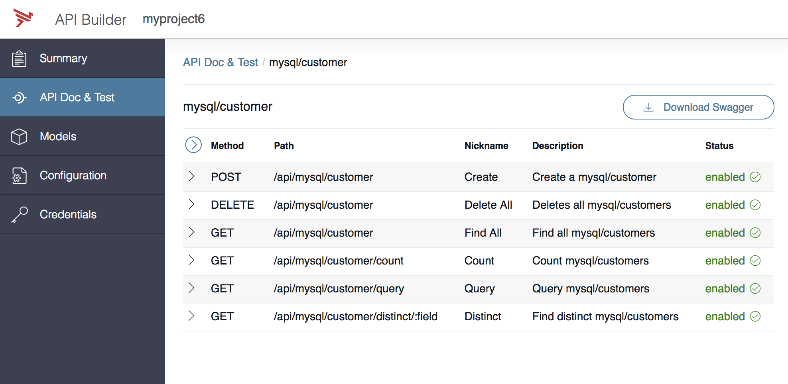

# API Builder & MySQL Quick Start

Creating a CRUD interface for MySQL tables – with API Builder and without coding!

You need these things on your Windows/Mac/Linux to do this exercise:

* [Docker](https://docs.docker.com/install/)
* [NodeJS](https://nodejs.org/en/download/)
* Web Browser
* Terminal / Command Prompt
* Text Editor (e.g. Atom)

## 1 - Run MySQL on your local machine

`docker run --rm --name mysql-test -p 3306:3306 -e MYSQL_ROOT_PASSWORD=axway -d mysql:5.7.24`

## 2 - Create DB table and data

Create a 'test' in MySQL, for this you can exec into the running container like this:

`docker exec -it mysql-test mysql -u root -paxway`

when you see the 'mysql>' prompt, type the following:

`create database test;`   
`use test;`   
`CREATE TABLE test.customer(customer_name VARCHAR(20) NOT NULL , customer_email VARCHAR(20) NOT NULL);`

Alternatively, you could run phpMyAdmin and create databases and tables using a GUI:

Run phpMyAdmin to create a database called 'test' and a database table:

Login with root/axway at http://localhost:8087/index.php

## 3 - Install API Builder and Create a Project

Open your Terminal (or Command Prompt) and go to your working directory (e.g. $HOME/projects), then do install API Builder like this:

`npm install -g @axway/api-builder`  
`api-builder init myproject`

Issue the commands that API Builder recommends:

`cd myproject333`   
`npm install --no-optional`   
`npm start`

## 4 - Install MySQL Connector

npm install @axway/api-builder-plugin-dc-mysql

The configuration file 	for the connector is located in `conf/conf/mysql.default.js` - open it in a text editor and set `modelAutogen: true`. You will see that API Builder will attempt to connect to MySQL at port 3306 on localhost, using the 'test' database we've created earlier.

## 5 - Start API Builder

Set environment variables for the MySQL connection:

On Mac/Linux:
`export MYSQL_USER=root`   
`export MYSQL_PASSWORD=axway`

On Windows:
`set MYSQL_USER=root`   
`set MYSQL_PASSWORD=axway`

And then start API Builder:
`npm start`

The model and API endpoints for your MySQL database table should automatically show up in Builder when you open http://localhost:8080/console/project/apidocs

[Tech Enablement](https://github.com/Axway/api-builder-standalone-tech-enablement)
