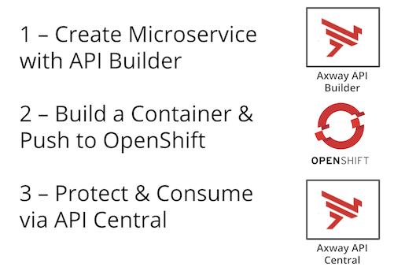

# API Builder on OpenShift & API Central

In this exercise you're going to build a microservice, push it on OpenShift and manage it with API Central.

You need these things to do this exercise:

* [Docker](https://docs.docker.com/install/) and [NodeJS](https://nodejs.org/en/download/) installed on your laptop
* Web Browser
* Terminal / Command Prompt
* Text Editor (e.g. Atom)
* Free account for [OpenShift Online](https://manage.openshift.com)
* Access to [API Central](https://apicentral.axway.com)

## 1 - Install API Builder and Create a Project

Open your Terminal (or Command Prompt) and go to your working directory (e.g. $HOME/projects), then install API Builder like this:

`npm install -g @axway/api-builder`  
`api-builder init myproject`

Issue the commands that API Builder recommends:

`cd myproject`   
`npm install --no-optional`   
`npm start`

