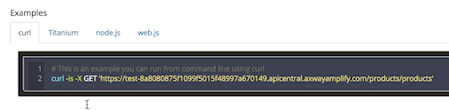
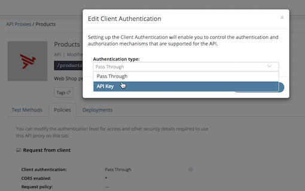

# API Builder on OpenShift & API Central

In this exercise you're going to build an API with API Builder, push it on OpenShift and manage it with API Central.

## Basics

### What is API Builder?

With [API Builder](https://www.axway.com/en/products/api-management/build-apis/builder-tool) you can easily create data models & API endpoints, using a GUI that runs on your laptop. Connectors allow you to access data from e.g. MySQL, Oracle or MongoDB, and you can build advanced logic & composite APIs with the graphical flow editor – without coding!

### What is OpenShift?

[OpenShift](https://www.openshift.com/) is a Platform-as-a-Service (PaaS) offering from Red Hat and a container orchestration platform using Docker + Kubernetes. Available online or on premise.

### What is API Central?

[API Central (BETA)](https://docs.axway.com/bundle/APICentralService_UserGuide_allOS_en_HTML5/page/Content/index.htm) is Axway's new cloud-based API Management solution.

## Setup

To do this exercise, you will need the following:

* [Docker](https://docs.docker.com/install/) and [NodeJS](https://nodejs.org/en/download/) installed on your laptop
* Access to [Docker Hub](http://hub.docker.com) 
* Web Browser
* Terminal / Command Prompt
* Text Editor (e.g. Atom)
* Free account for [OpenShift Online](https://manage.openshift.com)
* Access to [API Central](https://apicentral.axway.com)

## 1 - Install API Builder and Create a Project

Open your Terminal (or Command Prompt) and go to your working directory (e.g. $HOME/projects), then install API Builder like this:

`npm install -g @axway/api-builder`  
`api-builder init myproject`

Issue the commands that API Builder recommends (plus a temporary fix for a dependency issue):

`cd myproject`   
`npm install -save-dev highlight.js@9.14.2`   
`npm install --no-optional`   
`npm start`

## 2 - Create Data Model & API in the GUI

Open the API Builder GUI in your web browser at: [http://localhost:8080/console](http://localhost:8080/console) and navigate to the 'Models' tab. Click the '+' sign on the upper right to create a new model. We're going to make a simple model that will contain products in an online store:

Enter 'products' as the name for the model, add a description if you like and click 'Next'. Use the '+Field' button to add two fields to the model:

* Field name: product_name (type 'String', click 'Required' -> 'Add field to model)
* Field name: product_price (type 'String', click 'Required' -> 'Add field to model)

Connector: by default, data is stored in memory. You could install connectors to access & permanently store data in MySQL, Oracle or MongoDB. We might cover that in another exercise.

Click 'Next', where API Builder will create API endpoints for your model: 

Once you click 'Save' you're already done and have a full API CRUD interface for your products!

## 3 - Test the API in GUI & with cURL

Go to the 'API Doc & Test' tab in API Builder, and click on the 'products' API.

You can test the endpoints in the browser. Try to create a couple of products:

Then select and execute the 'Find All' request to list the products you have created:

API Builder will show you the corresponding cURL command which you could try on the command line. Did you notice the 'Download Swagger' button on the upper right? Click on it to get the full Swagger document for your API. If you've named the model 'products', it will be available at

[http://localhost:8080/apidoc/swagger.json?apis/products](ttp://localhost:8080/apidoc/swagger.json?apis/products)

Import it into [Postman](https://www.getpostman.com/), if you like!

## 4 - Create Docker Image

You may have seen that the folder for your API Builder project 'myproject' contains a Dockerfile - that's all we need to bake an image!

But before we do that, let's quickly remove the authentication for this API. We'll be adding that again at a later step. On the command line, stop API Builder (Control-C), then open the file conf/default.js and change access control from 'basic' to 'none':

Now we're ready to create the container image. What's your Docker ID? Let's assume it's patrickd, so the commands should look like this:

`docker login` (enter your Docker ID and password)   
`docker build . -t patrickd/products:1`

Assuming this is successful, you can now push the container image to Docker Hub:

`docker push patrickd/products:1`

The image will be public, and you should see it when you open [Docker Hub](https://hub.docker.com): 

## 5 - Deploy on OpenShift

Create a free account for OpenShift and create a project, use a short name without spaces in it. The rest we'll do on the command line, make sure you set up the [oc tool](https://github.com/CCI-MOC/moc-public/wiki/Installing-the-oc-CLI-tool-of-OpenShift).

In the OpenShift web gui, click 'Copy Login Command' (in the top right menu), and paste that into the terminal. This will allow you to access your Openhift project from the command line with 'oc':

From there it's pretty easy to deploy your new container image on OpenShift, using the command line:

`oc new-app patrickd/products:1`   
`oc expose dc/products`   
`oc expose svc/products`   

The first line creates a new app, and tells OpenShift to use a specific container image, the other two create routes so it's accessible to the outside world. Go back to the OpenShift GUI, you should see the new app:

If everything worked out, you should be able to click on the link and see the Axway logo. For security reasons, the deployed version does not give you a GUI. But simply add /apidoc/swagger.json?apis/products to the URL and you'll get Swagger document for the API endpoints:

Save that URL, we will need it for the next step.

## 6 - Protect & Consume with API Central

Log in into [API Central](https://apicentral.axway.com) and click on 'Register an API' 

Paste the Swagger URL into the new dialog:

Set the API name to 'Products', change the Base path to '/products/ and add a description:

Click 'Save'. Once the API was successfully registered, you can proceed to 'Test and configure your proxy'. The Products API should now be visible:

API Central will tell you to deploy the new revision (basically, the new API you've just imported), so let's just do that. Click on 'Deployments' and 'Deploy revision 1' as a Test Runtime.

Now you can access the API endpoints from API Central and manipulate data in the browser:

In the individual requests you will see the respective cURL commands for each method:

Go to the[ API Observer](https://apicentral.axway.com/api-observer/usage
) tab and inspect the requests you've made so far:

As a final step, let's protect the API endpoints. We'll require our consumers to use API Keys for authentication. In the 'Products' API Proxy, click on the 'Policies' tab and change the client authentication accordingly:

Repeat the deployment step (Deployents -> Deploy Revision 2). When you go back to the Test Methods, API Central will tell you that now you have to create an App with API Keys in order to access the endpoints:

Click on 'View your apps', create a new app and add authentication and APIs:

After that, you can make authenticated requests to the API endpoints using API Keys:

## 7 - Recap

Let's look back at what you have accomplished in this exercise. You've played with API Builder and saw how easy it is to create a data model & API endpoints, without having to write a single line of code. Docker helped packaging it up as a container image, which you've pushed to Docker Hub, the global container registry. From there it took you just a few steps to deploy this on OpenShift. You've then imported the API in API Central in order to protect it, add governance, authentication & analytics capabilities.

This concludes the lab. Your comments and suggestions will help to improve it. Please [create an issue](https://github.com/u1i/apibuilder/issues/new) if you encounter roadblocks!
