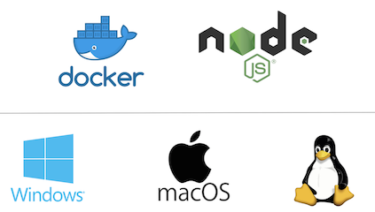

# API Builder on OpenShift & API Central

In this exercise you're going to build an API with API Builder, push it on OpenShift and manage it with API Central.

## Basics

### What is API Builder?

With [API Builder](https://www.axway.com/en/products/api-management/build-apis/builder-tool) you can easily create data models & API endpoints, using a GUI that runs on your laptop. Connectors allow you to access data from e.g. MySQL, Oracle or MongoDB, and you can build advanced logic & composite APIs with the graphical flow editor – without coding!

### What is OpenShift?

[OpenShift](https://www.openshift.com/) is a Platform-as-a-Service (PaaS) offering from Red Hat and a container orchestration platform using Docker + Kubernetes. Available online or on premise.

### What is API Central?

[API Central (BETA)](https://docs.axway.com/bundle/APICentralService_UserGuide_allOS_en_HTML5/page/Content/index.htm) is Axway's new cloud-based API Management solution.

## Setup

To do this exercise, you will need the following:

* [Docker](https://docs.docker.com/install/) and [NodeJS](https://nodejs.org/en/download/) installed on your laptop
* Access to [Docker Hub](http://hub.docker.com) 
* Web Browser
* Terminal / Command Prompt
* Text Editor (e.g. Atom)
* Free account for [OpenShift Online](https://manage.openshift.com)
* Access to [API Central](https://apicentral.axway.com)

## 1 - Install API Builder and Create a Project

Open your Terminal (or Command Prompt) and go to your working directory (e.g. $HOME/projects), then install API Builder like this:

`npm install -g @axway/api-builder`  
`api-builder init myproject`

Issue the commands that API Builder recommends:

`cd myproject`   
`npm install --no-optional`   
`npm start`

## 2 - Create Data Model & API in the GUI

Open the API Builder GUI in your web browser at: [http://localhost:8080/console](http://localhost:8080/console) and navigate to the 'Models' tab. Click the '+' sign on the upper right to create a new model. We're going to make a simple model that will contain products in an online store:

Enter 'products' as the name for the model, add a description if you like and click 'Next'. Use the '+Field' button to add two fields to the model:

* Field name: product_name (type 'String', click 'Required' -> 'Add field to model)
* Field name: product_price (type 'String', click 'Required' -> 'Add field to model)

Connector: by default, data is stored in memory. You could install connectors to access & permanently store data in MySQL, Oracle or MongoDB.

Click 'Next', where API Builder will create API endpoints for your model: 

Once you click 'Save' you're already done and have a full API CRUD interface for your products!

## 3 - Test the API in GUI & with cURL

Go to the 'API Doc & Test' tab in API Builder, and click on the 'products' API.

You can test the endpoints in the browser. Try to create a couple of products:

Then select and execute the 'Find All' request to list the products you have created:

API Builder will show you the corresponding cURL command which you could try on the command line. Did you notice the 'Download Swagger' button on the upper right? Click on it to get the full Swagger document for your API. If you've named the model 'products', it will be available at

[http://localhost:8080/apidoc/swagger.json?apis/products](ttp://localhost:8080/apidoc/swagger.json?apis/products)

http://products-uli.1d35.starter-us-east-1.openshiftapps.com/apidoc/swagger.json?apis/products
